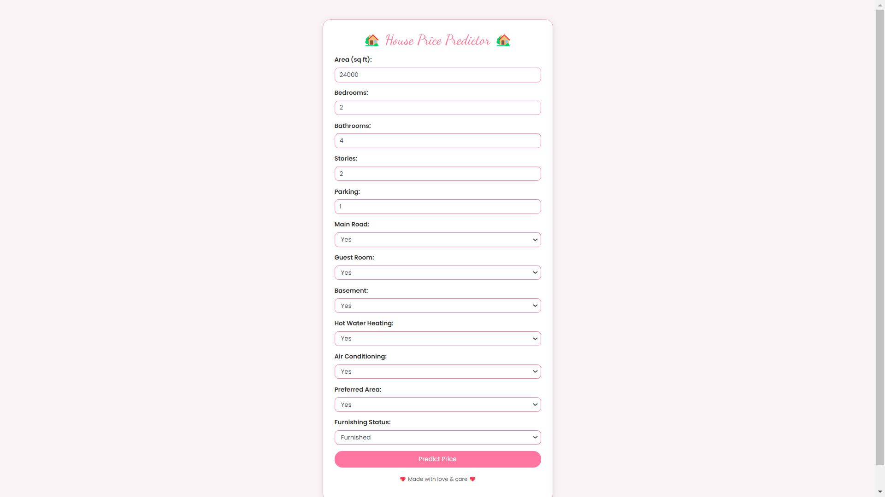
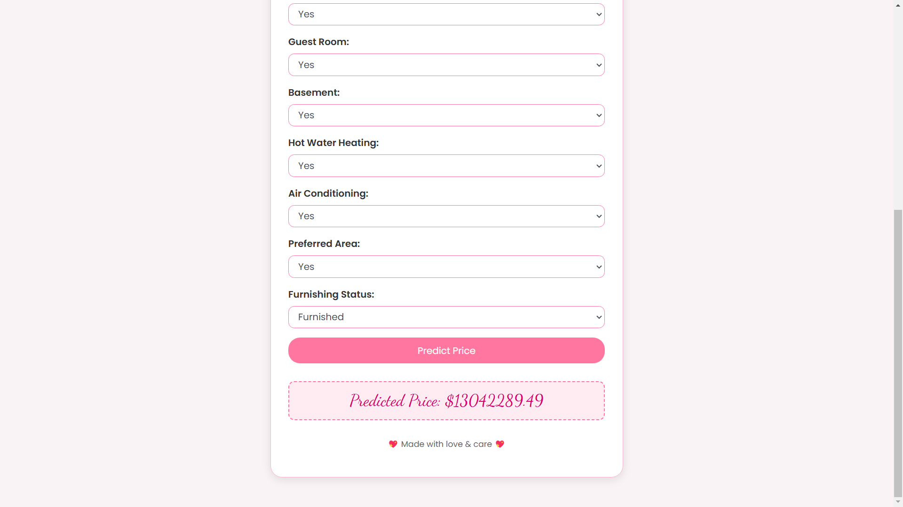

# House Price Prediction

This is a project focused on predicting house prices based on various features using machine learning algorithms. The objective is to develop a model that can accurately estimate the price of houses based on their attributes.

## Table of Contents

- Demo
- Introduction
- Technologies Used
- Dataset
- Installation
- Usage
- Model Development
- Results
- Contributing

## Demo

You can see a live demo of the application at the following link:

[Visit my House Price Predictor](https://house-price-predictor-xn3f.onrender.com)

## Introduction

House price prediction is a crucial area of real estate and economic studies, allowing buyers, sellers, and investors to make informed decisions. This project implements different machine learning techniques to forecast house prices based on various features such as the number of bedrooms, square footage, location, and other relevant attributes.

## Technologies Used

- Python
- Pandas
- NumPy
- scikit-learn
- Matplotlib
- Seaborn
- Jupyter Notebook (optional, for visualization and exploration)

## Dataset

This project utilizes a dataset that includes various features describing houses sold in a specific area. The dataset contains the following columns:

| Column Name          | Description                                             | Type                   |
|----------------------|---------------------------------------------------------|------------------------|
| `price`              | The sale price of the property                          | Numerical              |
| `area`               | Total area of the house (in square feet)               | Numerical              |
| `bedrooms`           | Number of bedrooms                                      | Numerical              |
| `bathrooms`          | Number of bathrooms                                     | Numerical              |
| `stories`            | Number of stories in the house                          | Numerical              |
| `parking`            | Number of parking spaces available                      | Numerical              |
| `mainroad`           | Whether the property is located on a main road (Yes/No)| Categorical (Yes/No)   |
| `guestroom`          | Whether the property has a guest room (Yes/No)         | Categorical (Yes/No)   |
| `basement`           | Whether the property has a basement (Yes/No)           | Categorical (Yes/No)   |
| `hotwaterheating`    | Whether the property has hot water heating (Yes/No)     | Categorical (Yes/No)   |
| `airconditioning`    | Whether the property has air conditioning (Yes/No)      | Categorical (Yes/No)   |
| `prefarea`           | Whether the property is in a preferred area (Yes/No)   | Categorical (Yes/No)   |
| `furnishingstatus`   | Status of furnishing (Furnished/Semi-furnished/Unfurnished)| Categorical (F/S/U)    |

## Installation

1. Clone the repository:

   ```bash
   git clone https://github.com/username/repository-name.git
   ```
   Replace username and repository-name with your actual GitHub username and repository name.

2. Navigate into the project directory:

   ```bash
   cd house_price_prediction
   ```
   
3. (Optional) Create and activate a virtual environment:

   ```bash
    python -m venv venv
    venv\Scripts\activate  # On Windows
    source venv/bin/activate  # On macOS/Linux
   ```

4. Install the required packages:

   ```bash
    pip install -r requirements.txt
   ```

## Usage

To make predictions using the trained model, refer to the provided scripts, which demonstrate how to load the model and input new data for predictions.

## Model Development
The project includes the following steps for the model development process:

1. Data Preprocessing: Cleaning and preparing data for analysis, filling in missing values, and feature engineering.
2. Data Visualization: Utilizing Matplotlib and Seaborn for data visualization to understand patterns and correlations.
3. Model Training: Implementing various regression algorithms such as:
   - Linear Regression
   - Decision Trees
   - Random Forests
   - XGBoost
4. Model Evaluation: Using metrics like Mean Absolute Error (MAE), Mean Squared Error (MSE), and R² score to evaluate model performance.

## Results
The project's results will include model performance metrics and visualizations. Detailed outcomes can be found in the Jupyter Notebooks or reports provided in the repository.

## Screenshots

### Form Submission


### Prediction Result


## Contributing
Contributions are welcome! Feel free to submit a pull request for any improvements, bug fixes, or feature additions. Please ensure that your code adheres to the project's style conventions.

Thank you for visiting this project repository! Feel free to provide feedback or ask questions.
