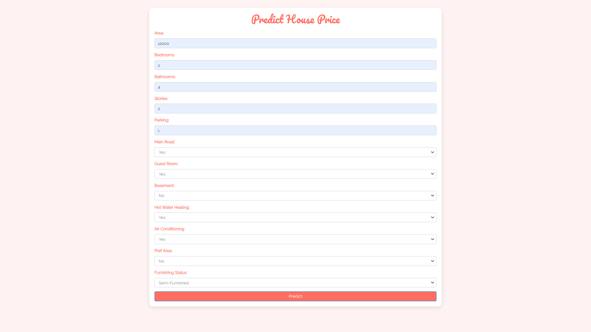

# House Price Prediction Application

## Description
The House Price Prediction Application is a web-based tool to estimate real estate values based on user-specified parameters, including area, number of bedrooms, bathrooms, stories, and other features. The application utilizes a Linear Regression model to give users accurate market price predictions. The front end is developed using standard HTML, CSS, and JavaScript, ensuring a straightforward implementation that can easily be adapted to React.js or similar frameworks for a more dynamic experience.

The user-friendly interface allows users to input various property characteristics, and upon submission, a predicted price is calculated and displayed in a neatly formatted popup. The application efficiently pre-processes categorical features using techniques like One-Hot Encoding and normalizes numerical features with standard scaling to enhance model performance.

## Requirements
To run this application, you need the following prerequisites:

- Python 3.x
- Flask
- Scikit-learn
- Pandas
- Bootstrap for styling (optional)
- HTML/CSS/JavaScript (for the frontend)

You can install the necessary Python packages using:

```bash
pip install flask scikit-learn pandas
```

## Instructions to Run the Application

1. Clone the Repository
```bash
git clone https://github.com/username/your-repo-name.git
cd your-repo-name
```

2. Install Requirements
Ensure all required libraries are installed (as mentioned above).

3. Run the Application
Execute the following command in the terminal:
```bash
python app.py
```

4. Open Your Browser
You can just navigate to http://127.0.0.1:5000/ to access the application.

5. Enter House Details
Fill out the form with the required details about the house and click the "Predict" button to see the predicted price.

## Screenshots
Below are screenshots illustrating the form submission and the predicted results.

### Form Submission


### Prediction Result


## Code Overview
- index.html: Contains the HTML structure and frontend logic for the prediction form and custom popup display.
- model.py: Houses the logic for data loading, preprocessing, model training, and prediction using Linear Regression.
- app.py: The Flask application handles user requests, processes form submissions, and returns predicted prices.

## React.js Adaptation
This application can easily be adapted to use React.js for a more dynamic front-end experience, allowing for component-based management of the UI and state handling.

## Acknowledgements
This application was developed using Flask and Scikit-learn.

Sadnyani Gomkar - [My GitHub Profile](https://github.com/sadnyani-4)
